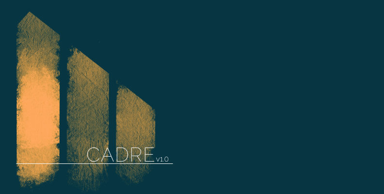
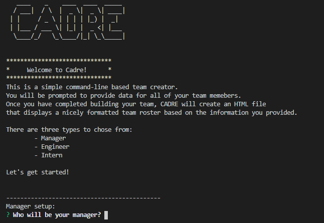
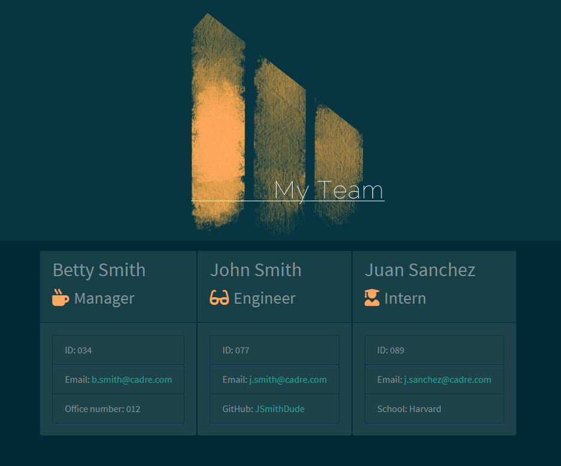

# Assemble Your Team!

Cadre is a small Node CLI that takes in information about your team and generates an HTML webpage that displays summaries for each person. This application allows for the quick generation of a nicely formatted HTML file.


## Table of Contents

* [Description](#description)
* [Installation](#installation)
* [Usage](#usage)
* [Testing](#testing)
* [Screenshots](#screenshots)
* [Questions](#questions)


## Description

* Simple command-line application that can be run through [Node.js](https://nodejs.org/en/)
* Consists of an `app.js` file, a `package.json` file, an empty folder named "output", which will store the generated HTML file, bootstrap theme, and logo image. There will also be a `lib` folder that contains all of the constructors, a `templates` folder with HTML template files, and a `test` folder that contains all of the Jest test files.
* Utilizes  the [Inquirer package](https://www.npmjs.com/package/inquirer), the [Jest package](https://www.npmjs.com/package/jest), and the [Figlet package](https://www.npmjs.com/package/figlet)


## Installation

* The Node.js runtime environment will need to be installed, first.
    * For more information, go to : [Node.js](https://nodejs.org/en/)
* Copy the files `app.js`, `package.json`, and all of the folders to a local storage location.
* Through a terminal, navigate to the location of the stored files
    * Install the required dependencies by running the following command in the Node runtime environment:
        ```
        npm i
        ```
* Once the dependencies are installed, run the `app.js` file
    * To run the file, use the following command:
        ```
        node app
        ```

## Usage

When the application is initiated, the user will be met with a series of questions. These questions will define the `Manager` role of the team and any number of `Engineers` and `Interns`. Once the user has completed answering all of the questions, a `team.html` file, a `Myteam452.png` file, and a `bootstrap.min.css` file will be placed in the "output" folder.

## Testing

`Jest` is installed as part of this CLI. Jest can be used to run tests on the supporting files in the `lib` directory.
* To run the tests, use this command:
        ```
        npm run test
        ```

## Screenshots

Example of application in use




Example of a completed HTML file




## Video

This link will allow to you download a small video file, which is a live demo of the application.

[Cadre Live Demo](https://github.com/Bertodemus/Cadre/raw/main/readme/video/Cadre.mp4)


## Questions

Feel free to get in touch with me if you have any questions or concerns.

Link to my GitHub Profile: [Bertodemus](https://github.com/bertodemus)

Email me at: [roberto@robertorubet.com](roberto@robertorubet.com)

